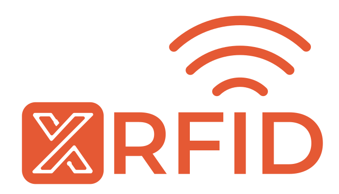

<!-- Improved compatibility of back to top link: See: https://github.com/othneildrew/Best-README-Template/pull/73 -->
<a name="readme-top"></a>

<!-- PROJECT SHIELDS -->
[![Contributors][contributors-shield]][contributors-url]
[![Forks][forks-shield]][forks-url]
[![Stargazers][stars-shield]][stars-url]
[![Issues][issues-shield]][issues-url]
[![MIT License][license-shield]][license-url]
[![LinkedIn][linkedin-shield]][linkedin-url]

<!-- PROJECT LOGO -->
<br />
<div align="center">
  <a href="https://github.com/XerumSrl/XRFID-Android-Samples">
    
  </a>

<h3 align="center">XRFID</h3>

  <p align="center">
    <!-- <a href="https://github.com/XerumSrl/XRFID-Android-Samples">View Demo</a>
    · -->
    <a href="https://github.com/XerumSrl/XRFID-Android-Samples/issues">Report Bug</a>
    ·
    <a href="https://github.com/XerumSrl/XRFID-Android-Samples/issues">Request Feature</a>
  </p>
</div>


<!-- TABLE OF CONTENTS -->
<details>
  <summary>Table of Contents</summary>
  <ol>
    <li>
      <a href="#about-the-project">About The Project</a>
      <ul>
        <li><a href="#built-with">Built With</a></li>
      </ul>
    </li>
    <li>
      <a href="#getting-started">Getting Started</a>
      <ul>
        <li><a href="#prerequisites">Prerequisites</a></li>
        <li><a href="#build">Build</a></li>
        <li><a href="#deploy">Deploy</a></li>
      </ul>
    </li>
    <li><a href="#usage">Usage</a></li>
    <li><a href="#roadmap">Roadmap</a></li>
    <li><a href="#contributing">Contributing</a></li>
    <li><a href="#license">License</a></li>
  </ol>
</details>


<!-- ABOUT THE PROJECT -->
## About The Project

This project is designed to provide a sample of the RFID capabilities of Zebra mobile devices

This repository is deprecated and currently unmaintained, see [XRFID-Demo](https://github.com/XerumSrl/XRFID-Demo) for a more up to date version.

<p align="right">(<a href="#readme-top">back to top</a>)</p>


### Built With

* [![dotNet][dotnet-badge]][dotnet-url]
* [![MAUI][MAUI-badge]][MAUI-url]
* [![MAUI][zebra-MAUI-badge]][Zebra-MAUI-url]
* [![MAUI][SF-badge]][SF-url]

<p align="right">(<a href="#readme-top">back to top</a>)</p>


<!-- GETTING STARTED -->
## Getting Started

note: this android application cannot be deployed to Device Emulator or any non-Zebra devices, any device not mentioned in the Prerequisites section has not been tested and it is not guaranteed to work

### Prerequisites
* Know Your PC IP address
* Open ports 5098 and 7098 and/or forward them
* One of the following Zebra devices:
  * MC33x RFID
  * TC2x + RFD40
  * TC5x + RFD40
  * TC7x + RFD90
* Visual Studio 2022 17.7 or later with the following workloads intalled:
  * ASP.NET and web development
  * .NET Multi-Platform App UI development
* A syncfusion License Key, [here](https://support.syncfusion.com/kb/article/9795/how-to-get-community-license-and-install-it) is how you can get a free SyncFusion Community license key 

### Build

1. Have your Device ready with ADB enabled
2. Get a SyncFusion Community license key
3. Clone the repo
    ```sh
    git clone https://github.com/XerumSrl/XRFID-Android-Samples.git
    ```
4. Open the Solution (If needed Authorize your PC on the ADB Prompt on the device)
3. add your SyncFusion key in
    ```
    XRFID.Client.Mobile/App.xaml.cs at
    .RegisterLicense("your_syncfusion_license");
    ```
4. Build Solution

### Deploy

1. Start XRFID.Sample.Webservice
2. Deploy XRFID.Sample.Client.Mobile
3. Start Application on device
4. Go to setting and note down DeviceId
5. On your PC open a browser and go to [http://localhost:5098/swagger](http://localhost:5098/swagger)
6. Go to Reader/Post and add a reader with the Id you noted down.

<p align="right">(<a href="#readme-top">back to top</a>)</p>


<!-- USAGE EXAMPLES -->
## Usage

This application can be used to look for RFID tags and pinpoint an RFID tag location and.
the application can also scan a Barcode that can be used (with an appropriately configured backend) to get a collection of RFID tags and subsequently verify if they are present.

<p align="right">(<a href="#readme-top">back to top</a>)</p>


<!-- ROADMAP -->
## Roadmap

- [ ] Easier device (reader) enrollment
- [ ] Authenticated APIs
- [ ] UI to Add data and devices to the backend

See the [open issues](https://github.com/XerumSrl/XRFID-Android-Samples/issues) for a full list of proposed features (and known issues).

<p align="right">(<a href="#readme-top">back to top</a>)</p>


<!-- CONTRIBUTING -->
## Contributing

Contributions are what make the open source community such an amazing place to learn, inspire, and create. Any contributions you make are **greatly appreciated**.

If you have a suggestion that would make this better, please fork the repo and create a pull request. You can also simply open an issue with the tag "enhancement".
Don't forget to give the project a star! Thanks again!

1. Fork the project
2. Create your feature branch (`git checkout -b amazing-feature`)
3. Commit your changes (`git commit -m 'feat: Add some AmazingFeature'`)
4. Push to the branch (`git push origin amazing-feature`)
5. Open a Pull Request

<p align="right">(<a href="#readme-top">back to top</a>)</p>


<!-- LICENSE -->
## License

Distributed under the MIT License. See `LICENSE.txt` for more information.

<p align="right">(<a href="#readme-top">back to top</a>)</p>

<!-- ACKNOWLEDGMENTS -->
## Acknowledgments

* [MAUI EMDK sample](https://github.com/ZebraDevs/emdkMAUIapp)

<p align="right">(<a href="#readme-top">back to top</a>)</p>


<!-- MARKDOWN LINKS & IMAGES -->
<!-- https://www.markdownguide.org/basic-syntax/#reference-style-links -->
[contributors-shield]: https://img.shields.io/github/contributors/XerumSrl/XRFID-Android-Samples.svg?style=for-the-badge
[contributors-url]: https://github.com/XerumSrl/XRFID-Android-Samples/graphs/contributors
[forks-shield]: https://img.shields.io/github/forks/XerumSrl/XRFID-Android-Samples.svg?style=for-the-badge
[forks-url]: https://github.com/XerumSrl/XRFID-Android-Samples/network/members
[stars-shield]: https://img.shields.io/github/stars/XerumSrl/XRFID-Android-Samples.svg?style=for-the-badge
[stars-url]: https://github.com/XerumSrl/XRFID-Android-Samples/stargazers
[issues-shield]: https://img.shields.io/github/issues/XerumSrl/XRFID-Android-Samples.svg?style=for-the-badge
[issues-url]: https://github.com/XerumSrl/XRFID-Android-Samples/issues
[license-shield]: https://img.shields.io/github/license/XerumSrl/XRFID-Android-Samples.svg?style=for-the-badge
[license-url]: https://github.com/XerumSrl/XRFID-Android-Samples/blob/master/LICENSE.txt
[linkedin-shield]: https://img.shields.io/badge/-LinkedIn-black.svg?style=for-the-badge&logo=linkedin&colorB=555
[linkedin-url]: https://it.linkedin.com/company/xholding
[product-screenshot]: images/screenshot.png
[MAUI-badge]: https://img.shields.io/badge/.NET%20MAUI-AC99EA
[MAUI-url]: https://dotnet.microsoft.com/en-us/apps/maui
[SF-badge]: https://img.shields.io/badge/SyncFusion%20MAUI--F6921E?labelColor=2B357C
[SF-url]: https://www.syncfusion.com/maui-controls
[Zebra-MAUI-badge]: https://img.shields.io/badge/Zebra%20EMDK%20MAUI-FFFFFF
[Zebra-MAUI-url]: https://developer.zebra.com/blog/developing-net-maui-zebra-androidtm-devices
[dotnet-badge]: https://img.shields.io/badge/.NET%20Core%207-512bd4
[dotnet-url]: https://dotnet.microsoft.com/en-us/
